Jinxxy served the DMCA notice, removed the reported URLs and notified all parties. No further action is needed at this time.

---
*Reporter's Name*: [private] 
*Copyright Holder's Name*: [private] 
*Reporter's Email Address*: verypermanent@gmail.com 
*Reporter's Company Name*: Dawgie (digital brand; legal company name not supplied) 
*Reporter's Telephone Number*: [private] 
*Reporter's Address*: [private] 

Reported URLs:

	https://jinxxy.com/Suhween/HKwom
	https://jinxxy.com/Suhween/mIf0K
	https://jinxxy.com/Suhween/mSfMY

---
Dear Jinxxy DMCA Agent, Please find attached a comprehensive Formal Report of Copyright Infringement detailing a severe case of cross-platform enforcement evasion currently occurring on your platform. The vendor operating the storefront "Suhween" is actively utilizing Jinxxy to host, monetize, and distribute stolen digital assets that have already been permanently banned elsewhere due to verified copyright violations. Please note the following critical context regarding this merchant's activities:

1. PROVEN HIT-AND-RUN PATTERN: I formally escalated this infrastructure theft to Payhip Legal Operations on September 26, 2026. The seller refused to respond to legal notices or cooperate with platform investigators for over a week. Consequently, Payhip verified my exclusive design ownership, found the seller in direct violation, and permanently deactivated her entire storefront assets.

2. ENFORCEMENT EVASION ON JINXXY: Rather than complying with intellectual property law, the seller immediately migrated the exact same stolen assets to Jinxxy—specifically the "Gigi" avatar asset and three additional unauthorized custom clothing/design assets. The seller's Jinxxy descriptions still actively redirect users to her banned, dead external store domains (suhween.com/gigi), proving these listings are a direct continuation of the infringement.

3. EXPLICIT REVOCATION OF RIGHTS: For the avoidance of doubt, any and all implied usage permissions, reciprocal development agreements, or distribution allowances between myself and this seller have been completely and irrevocably revoked. Her continued commercial exploitation of my underlying 2D artwork, custom layouts, and geometric schemas constitutes willful copyright infringement under 17 U.S.C. § 512.

4. SCOPE OF ADDITIONAL ASSETS: The attached PDF documentation outlines my exclusive ownership over the foundational design elements used across her entire product suite. This includes the "Gigi" asset and the three additional clothing/design assets listed in the report index. Credit is not a substitute for a legal commercial license; the presence of these assets on Jinxxy without my express authorization requires immediate, platform-wide removal. I have attached the full, formalized DMCA PDF Investigation Report containing timestamped design handovers, concrete priority tracking, and direct written admissions from the seller acknowledging my absolute ownership of the source material. Given the verified cross-platform evasion and the seller's active refusal to cooperate with legal procedures, I request that Jinxxy act expeditiously to disable these endpoints and protect the integrity of your marketplace.

Thank you for your prompt, serious attention to this legal matter.

Sincerely, [private] (Digital Brand: Dawgie) ://payhip.com

---
Attached PDF report, text transcription and embedded figure images (original PDF held internally):

FORMAL REPORT OF COPYRIGHT INFRINGEMENT &
COMPLIANCE INVESTIGATION DATA
To: Jinxxy Legal & Copyright Operations

Date: September 26, 2026

Complainant: [private] (Digital Merchant: Dawgie / payhip.com)

Prior Business Aliases: Astro Vision / Astro

Respondent Storefront: suhween (payhip.com)

Subject: Multi-Item Unauthorized Commercial Exploitation of Underlying 2D
Intellectual Property

I. REASON FOR REPORT & EXECUTIVE SUMMARY
This document outlines a formal investigation request regarding ongoing copyright
infringement under 17 U.S.C. § 512. The merchant operating the storefront
suhween is actively distributing and monetizing multiple 3D digital assets that
constitute unauthorized derivative works. These products rely entirely on underlying
2D character concepts, clothing layouts, and schemas authored exclusively by [private] (previously operating under the brand design aliases Astro Vision / Astro).

The respondent has unilaterally severed business operations, blocked the
complainant, and stripped the complainant of reciprocal usage rights while retaining,
hosting, and profiting from the complainant’s underlying design layouts without an
active commercial license or compensation structure.

     Prior Enforcement Context:
     The underlying infringing material listed below was previously hosted on
     Payhip. Following a formal investigation and report submitted on
     September 26, 2026, Payhip Legal Operations verified my exclusive
     ownership and permanently deactivated her storefront assets. The
     respondent has moved these exact same stolen items to your platform to
     bypass that enforcement.

Infringing Product Group Index:

---

   1.​ "Gigi" Avatar Asset – Hosted at live domain listing:
      https://jinxxy.com/Suhween/HKwom
   2.​ Unauthorized Design Asset 01 – Hosted at product endpoint:
      https://jinxxy.com/Suhween/mIf0K
   3.​ Unauthorized Design Asset 02 – Hosted at product endpoint:
      https://jinxxy.com/Suhween/mSfMY

II. CHRONOLOGY & EVIDENCE OF ORIGINAL OWNERSHIP
The complainant possesses permanent, timestamped digital records establishing
clear chronological priority over the creative assets:

   ●​ August 18, 2026 (Design Delivery): The complainant completely finalized
      and delivered the original 2D "Claw Machine Girl" reference and concept
      boards to the respondent. This delivery occurred prior to any 3D environment
      drafting or model building.

---

Figure 1: Timestamped communication log proving the complainant delivered the completed 2D concept schema on August 18, 2026, establishing clear priority.

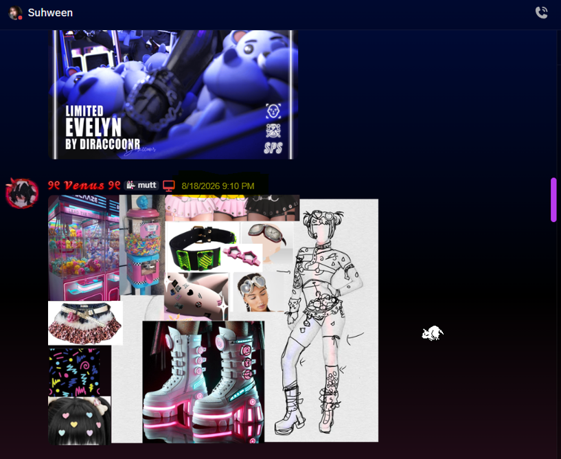

   ●​ August 21, 2026 (3D Derivation Starts): The respondent initiated
      3D development explicitly using the complainant's design framework as
      the baseline reference, seeking feedback directly from the complainant
      on the structural execution.

---

Figure 2: Communication log dated August 21, 2026, proving the respondent derived her 3D model directly from the complainant’s underlying artwork.

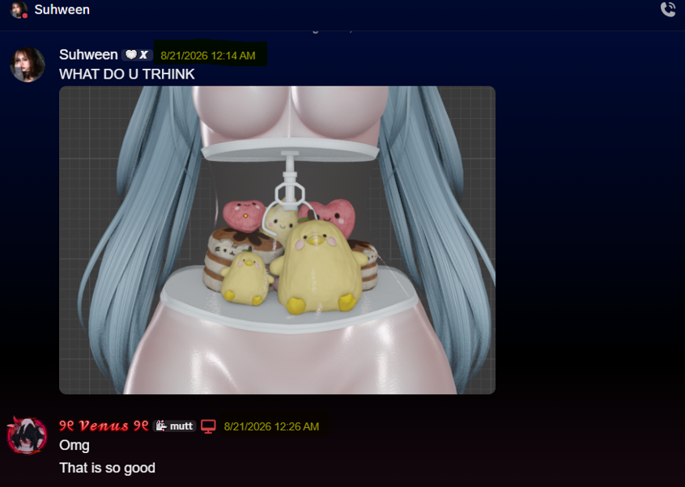

●​    Core Protected Elements: The distinct creative elements designed
      exclusively by the complainant include:
         1.​ A clear, structural transparent glass torso/tummy designed to look like
             functional claw machine, complete with an integrated mechanical claw
             hanging from the top middle interior housing prize capsule items.
         2.​ A stylized gumball machine apparatus structurally integrated onto the lower
             leg frame.
         3.​ A custom structural arm-bar detail.
         4.​ Specific character clothing geometry and interior item layouts, including the
             exact arrow design bikini set, matching arrow hair clips, a Tamagotchi
             attached to the waistband, the boots, leg warmers, band-aids, and the
             pleated skirt layout.

---

Figure 3: Complainant's original 2D character reference sheets, concept art layouts, and thematic design parameters finalized on August 18, 2026, establishing unambiguous priority of ownership.

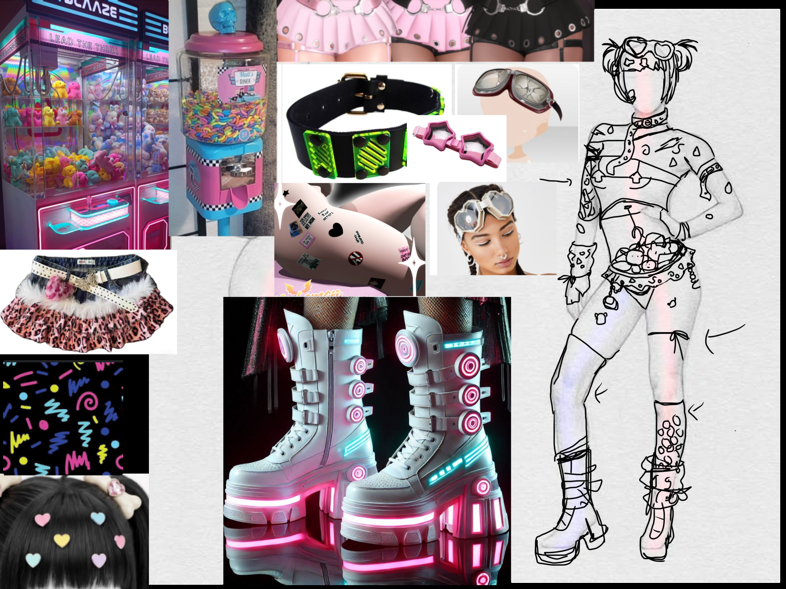

Supplemental Proof: Established Pattern of Conceptual Reliance

To demonstrate that the "Gigi" project was not an isolated incident, the following
timestamped records establish a long-running operational pattern where the
respondent explicitly sought out, relied upon, and requested my unique 2D design
layouts due to my specific creative style:

   ●​ March 19, 2026: In early communication logs, the respondent heavily praised
      my 2D illustration portfolio, explicitly stating: "DUDE STOP YOUR SO
      CREATIVEEEEEE I love your style and would absolutely be honored if you'd
      let me... your work is so pretty dude." This proves a documented history of her
      acknowledging me as the foundational creative source.

---

                                                                                    ​
Figure 4: Communication log establishing the respondent's early acknowledgment and admiration of the complainant's distinct 2D design style.

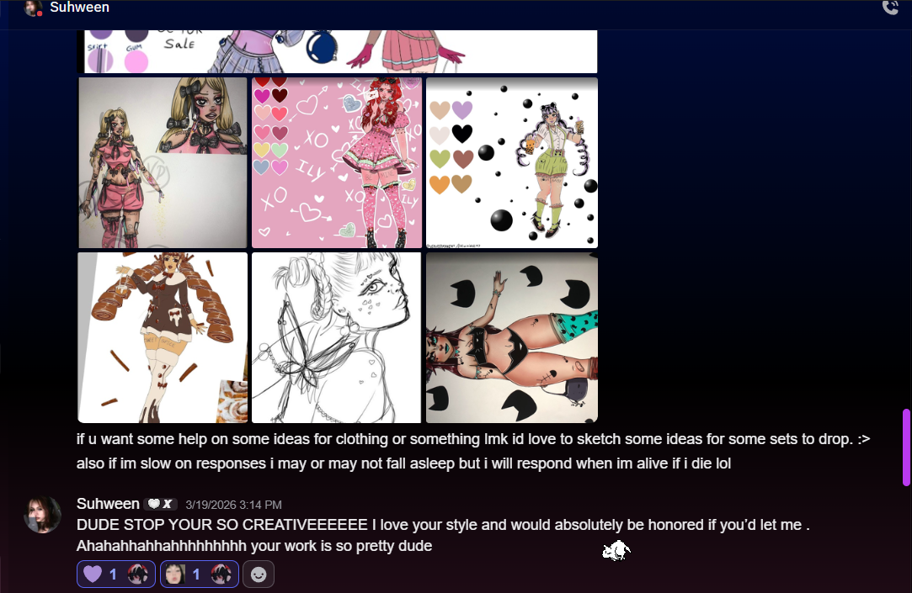

   ●​ June 26, 2026: In a separate exchange, when I offered to create an outfit
      design, the respondent enthusiastically requested my design assets, stating
      verbatim: "YESSSD PLEASEEEEEESSSES." This further documents that the
      respondent actively depended on my design contributions to initiate her
      development pipelines

                                                                                    ​
Figure 5: Timestamped communication log proving the respondent explicitly requested custom design assets from the complainant. [image_2Hn3Ar.png]

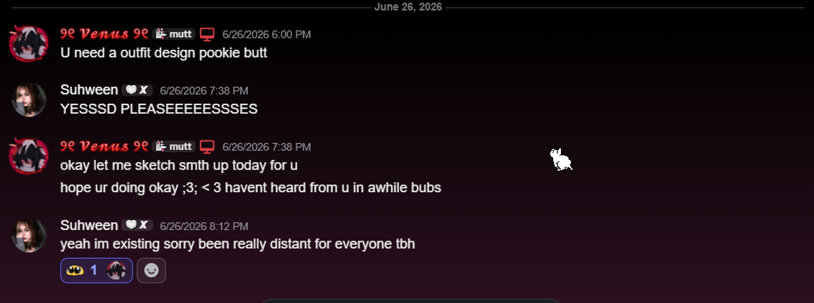

---

III. MATERIAL EVIDENCE & ADMISSIONS BY THE
RESPONDENT
The respondent has explicitly acknowledged the complainant's sole ownership of the
underlying creative concepts across several distinct written mediums. This evidence
is preserved via permanent chat databases and live store media:

A. Written Admission of Character Concept Source Material
In direct communication logs dated September 12, 2026, the respondent explicitly
admitted that the design was authored by the complainant and that the 3D model
would not exist without it, stating verbatim:

     "The original idea/design was urs and i genuinely do appreciate that and i
     wouldnt have made what i made without that starting point."

Figure 6: Discord communication log highlighting the respondent's explicit confirmation of underlying design priority and ownership.

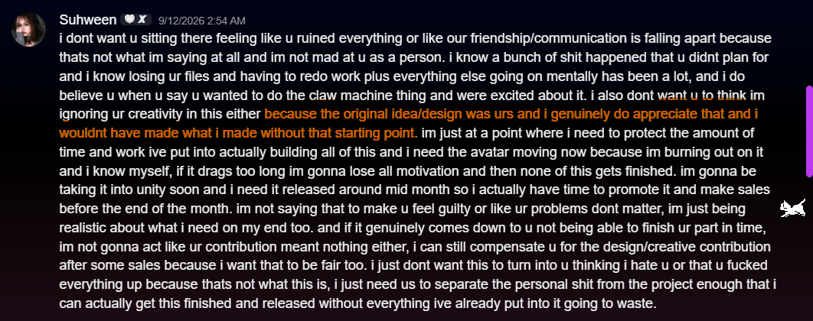

B. Admission of Unfulfilled Compensation Requirements

---

In the same communication sequence, the respondent explicitly recognized that
utilizing the design required an ongoing financial or compensatory agreement to
remain legally sound, writing:

     "I can still compensate u for the design/creative contribution after some
     sales because i want that to be fair too."

Figure 7: Discord communication log highlighting the respondent's explicit acknowledgement of required financial compensation for creative assets.

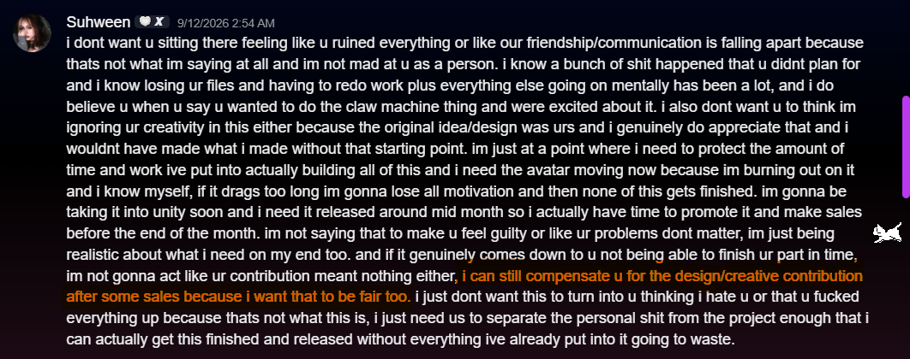

No compensation has ever been authorized or transferred. Following this exchange,
the respondent terminated contractual relations, revoked the complainant's project
permissions, and published the file for sole corporate monetization.

C. Public Confession Exhibited on Live Storefront Media

The respondent updated the active Payhip product storefront with a text promotional
graphic titled "Suhween × Dawgie." This graphic, authored and uploaded by the
respondent, contains direct public confessions of the underlying infringement:

   ●​ Admission of Derivation: The graphic explicitly notes that the product
      "originally began as a collaborative concept between Suhween and Dawgie...
      and Suhween continued developing the concept into the final Gigi release
      shown here."
   ●​ Admission of Exclusion: The graphic explicitly reports that the complainant
      has been barred from distributing the companion project assets, stating:
      "Dawgie has been directly asked not to release that version."

---

D. Active Tampering of Evidence and Storefront Deception

Following the initiation of this dispute, the respondent actively modified her live
Payhip storefront page to strip out and rewrite explicit acknowledgments of my
ownership in a deliberate attempt to retroactively alter the history of the
asset's creation.

I have preserved the exact chronological changes showing this bad-faith tampering:

   ●​ 1. Original Text Layout (Before): In her initial storefront release graphic, the
      text tried to blur the lines of sole design ownership by stating: "A look back at
      the original visual direction created by suhween x dawgie and the ideas that
      eventually evolved into gigis final design.

---

Figure 8 : Original storefront graphic showcasing the initial release text trying to split conceptual credit.

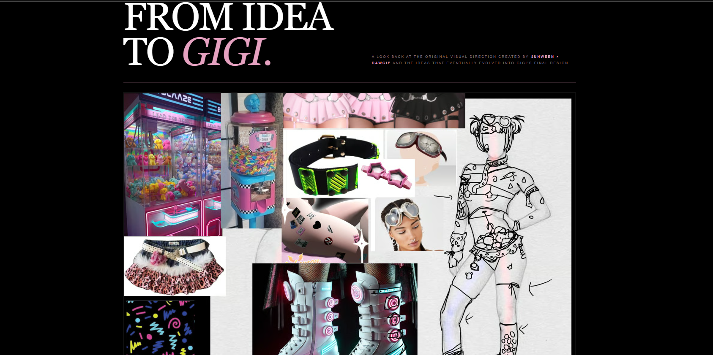

   ●​ 2. Altered Text Layout (Altered Overnight After Dispute): Following our
      formal dispute, the respondent panicked and updated the live graphic to explicitly
      state that the product was built from an original design created by me ("Dawgie").
      The text now reads: "Gigi began from an original design created by Dawgie.
      From that starting point, Suhween continued to develop..." While she likely updated
      this to make her storefront look legitimately licensed to Payhip investigators, she has
      effectively published a full, written confession on her live store page confirming I am
      the sole author of the underlying 2D design.

---

Figure 9: Altered storefront graphic uploaded overnight, creating a direct confession of underlying design ownership.

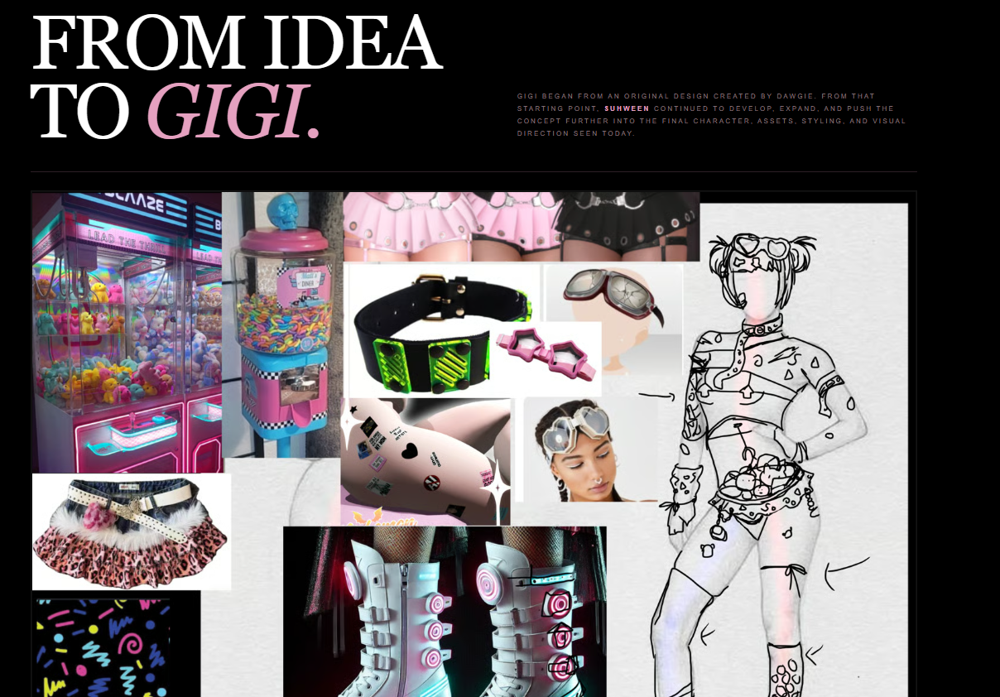

   ●​ 3. Explicit Admission of Contract Termination and
      Commercial Exclusion: Despite modifying the concept art block, the
      respondent kept "Slide 06" active in her storefront media carousel. This slide
      serves as direct, written confirmation that she terminated the collaborative
      release model while unilaterally exploiting my original 2D intellectual property
      for her own exclusive profit.

---

●​ Figure 10: Companion slide text on live storefront openly admitting the broken collaboration and commercial exclusion

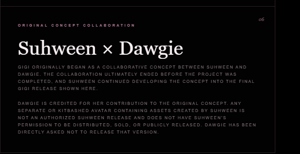

E. Direct Evidence of Contract Breach and Account Exclusion
To establish that the respondent willfully terminated our reciprocal development
agreement and stripped away my authorized usage permissions, I have preserved
the direct text communications and system logs detailing the contract termination.

   ●​ 1. Direct Admission of Design Theft and License Revocation (September
      23, 2026): In a final closing message, the respondent explicitly acknowledges
      that the entire concept originated with me, writing: "i understand that the
      original arcade/claw machine concept started with you and im not trying to
      take that away from you..." However, she immediately follows this by
      unilaterally revoking my permission to use any assets while demanding I
      completely kill my project. This message serves as direct proof that she broke
      our reciprocal agreement while continuing to monetize my design elements.

---

   ​
Figure 11: Direct message log where the respondent explicitly admits the concept belongs to the complainant while simultaneously revoking all reciprocal contract permissions.

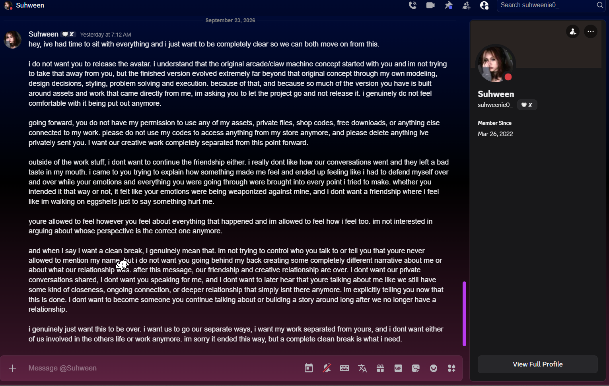

●​ 2. Abrupt Server Removal and Digital Exclusion (September 23, 2026):
   Immediately after sending the message revoking my project rights, a server
   moderator officially banned and removed me from the development server

                                                                                    ​
   ​
Figure 12: System notification log proving the immediate, hostile exclusion of the complainant from the shared development environment.

---

   ●​ 3. Public Cancellation and Retroactive Modification of Collaboration
      Terms (September 16, 2026): Following the unilateral termination of our
      contract, the respondent went back and actively edited her public server
      announcements. She retroactively crossed out my name ("Dawgie") and
      updated the text to explicitly notify consumers that our collaboration was dead
      and that she was actively suppressing my release, while continuing to market
      her solo launch to capture 100% of the commercial profit.

]Figure 13: Public announcement log showcasing the respondent's post-breach edit to publicly suppress the complainant's release.

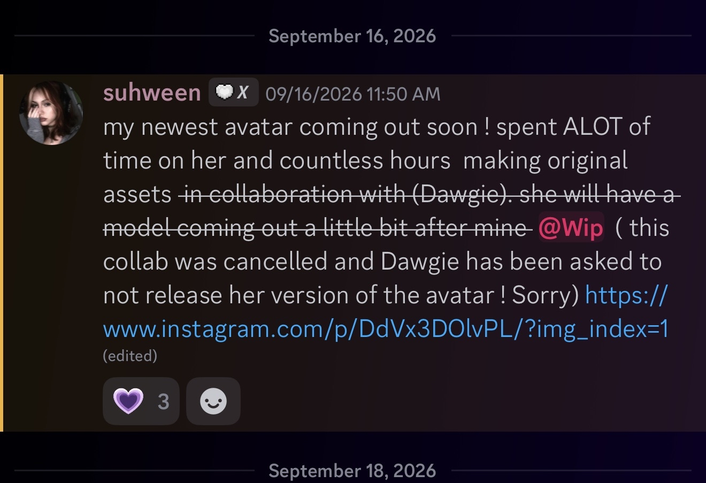

IV. LEGAL CONCLUSION
A joint or collaborative development track requires a mutual meeting of the minds
and an ongoing fulfillment of terms. By terminating the project framework,
withholding reciprocal asset access, and failing to provide compensation, the
respondent has completely invalidated any implied license to distribute the

---

complainant's 2D artistic layout choices. Crediting a creator on a store listing does
not replace an active, valid commercial copyright license. The current product listed
at ://payhip.com is a clear, actionable copyright violation.

V. CERTIFICATION & SENDER IDENTIFICATION
Under penalty of perjury, I certify that the information contained within this document
is accurate, and that I am the exclusive copyright owner of the underlying 2D artwork
and concept schema described herein.

   ●​ Legal Name: [private]
   ●​ Mailing Address: [private]
   ●​ Phone Number: [private]
   ●​ Verification Storefront: payhip.com

Electronic Signature:

/[private]/
